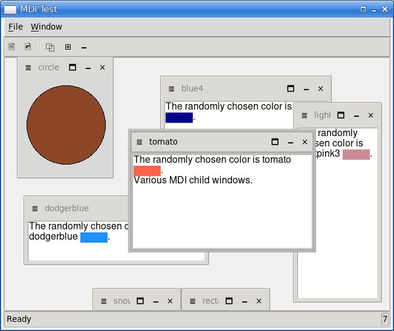
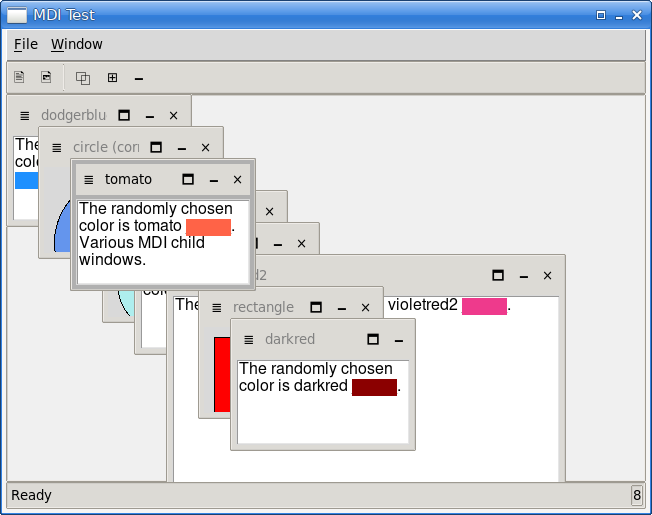
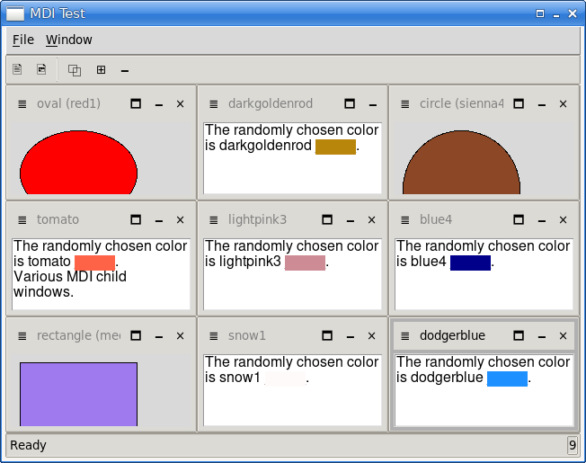
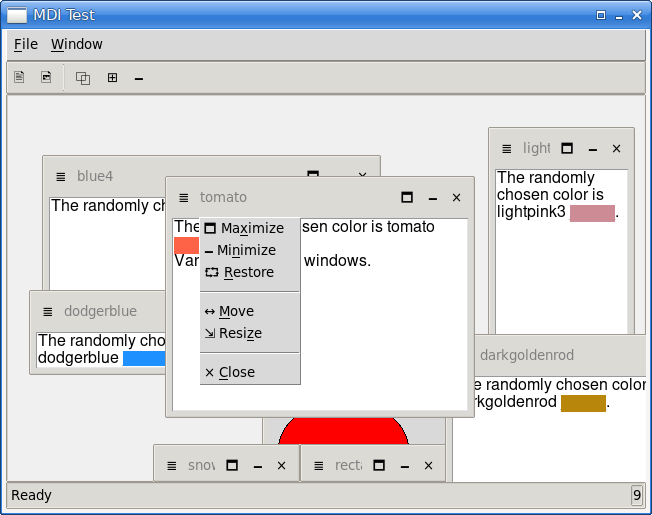
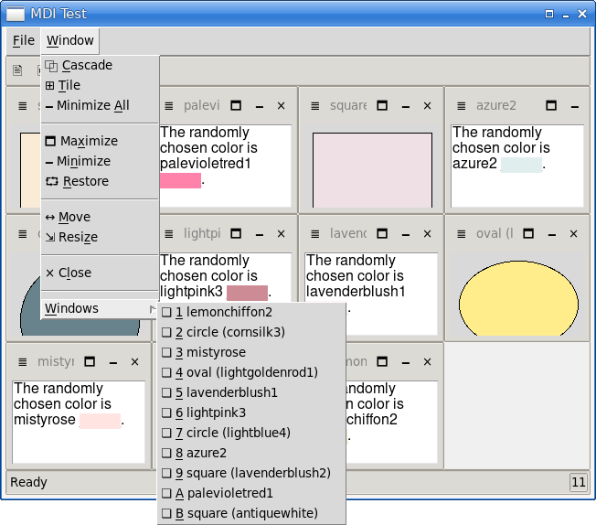

# MDI (Multiple Document Interface)

The `mdi::Window` class is used to manage `mdi::child` windows.

See `mdi_test.tk` for an example of use. If the scale is too small, pass a
scale argument, e.g., `mdi_test.tk 1.5`. It is also possible to pass a theme
argument, e.g., `mdi_test.tk 1.5 classic` (the order of arguments doesn’t
matter).

|  |
|:--:|
| *7 Child Windows; arbitrary sizes and positions* |

||
|:--:|
| *8 Child Windows cascaded* |

||
|:--:|
| *9 Child Windows tiled* |

||
|:--:|
| *The child window menu* |

||
|:--:|
| *The Window menu* |

Note: I use [Store](https://github.com/mark-summerfield/store) for version
control so github is only used to make the code public.

## Installing

The module is entirely self-contained. To use `mdi-3.tm` either put it in
one of your package paths or copy it into your application’s folder.

## Documentation

See `mdi.html`.

## Dependencies

Tcl/Tk >= 9.0.2.

## License

GPL-3. This module was created by a human.

---
